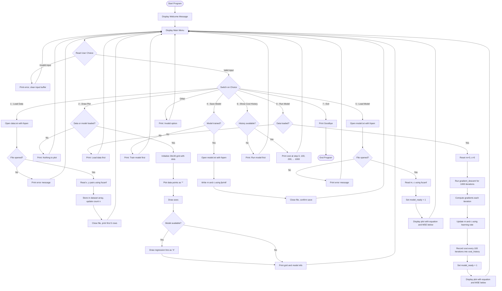

# Menu-Driven Linear Regression System in C

> **Course:** CSE 1210 — Open-Ended Lab Experiment
> **Formatting Note:** When exporting to Word/PDF, use Font Size 12, Font Name: Times New Roman, Justify Align.

---

## 1. Introduction

This project presents a **Menu-Driven Linear Regression System** developed entirely in the C programming language. The system allows users to load a dataset from a file, train a linear regression model using the Gradient Descent optimization algorithm, visualize the results through an ASCII-based graph, and save or load the trained model parameters to and from files.

The project was designed to demonstrate core C programming concepts required by the open-ended lab experiment, including:

- **User-defined functions** with both "call by value" and "call by reference."
- Use of **arrays** (for storing data points) and **strings** (for filenames).
- **If-else statements** and **loop statements** throughout the logic.
- **FILE I/O** operations using `fscanf`, `fprintf`, `fopen`, and `fclose`.
- Use of **structures**, **enums**, and various **data types, operators, and expressions**.

---

### 1.1 Motivation and Background

Linear regression is one of the most fundamental algorithms in statistics and machine learning. It models the relationship between a dependent variable $y$ and an independent variable $x$ by fitting a straight line of the form:

$$y = mx + c$$

where $m$ is the slope and $c$ is the y-intercept.

While modern languages like Python offer built-in libraries (e.g., scikit-learn) to perform linear regression in a single line of code, implementing it from scratch in C provides a much deeper understanding of:

- How the underlying mathematical optimization actually works step-by-step.
- How to manage memory, arrays, and structures in a low-level language.
- How file I/O operations are performed at a fundamental level.

This project was motivated by the desire to bridge the gap between theoretical math and practical C programming skills.

---

### 1.2 Objectives

The main objectives of this project are:

1. To implement an **interactive, menu-driven console application** in C.
2. To develop **file handling capabilities** to load datasets from text files and save/load trained model parameters.
3. To implement the **Gradient Descent algorithm** from scratch to train a linear regression model and minimize the Mean Squared Error (MSE).
4. To create an **ASCII-based graph** that visually plots data points and the regression line directly in the terminal.
5. To apply core C programming concepts such as structures, arrays, strings, pointers, loops, conditional statements, and file I/O in a meaningful project.

---

## 2. Current Works

Linear regression is widely used in various fields such as economics, engineering, and data science for tasks like trend prediction and forecasting. In practice, tools like Python's scikit-learn, MATLAB, and R provide high-level abstractions for performing regression analysis.

However, these tools hide the underlying implementation details. For a first-year computer science student, implementing the algorithm manually in C is valuable because it exposes the actual computation involved in training a model — computing costs, calculating gradients, and iteratively updating parameters. This project serves as an educational exercise to understand these concepts at a fundamental level before moving to higher-level tools in future courses.

---

## 3. Methodology

### Mathematical Foundation

The project uses the following mathematical concepts:

**1. Linear Model (Hypothesis):**

The model predicts a value $\hat{y}$ for a given input $x$ using:

$$\hat{y} = mx + c$$

where $m$ is the slope (weight) and $c$ is the y-intercept (bias).

**2. Cost Function — Mean Squared Error (MSE):**

To measure how well the model fits the data, we compute the Mean Squared Error:

$$J(m, c) = \frac{1}{2n} \sum_{i=1}^{n} (\hat{y}_i - y_i)^2$$

where $n$ is the number of data points, $\hat{y}_i$ is the predicted value, and $y_i$ is the actual value. A lower cost means a better fit.

**3. Gradient Descent — Parameter Update Rules:**

To minimize the cost function, we compute the partial derivatives (gradients) with respect to $m$ and $c$:

$$\frac{\partial J}{\partial m} = \frac{1}{n} \sum_{i=1}^{n} (\hat{y}_i - y_i) \cdot x_i$$

$$\frac{\partial J}{\partial c} = \frac{1}{n} \sum_{i=1}^{n} (\hat{y}_i - y_i)$$

The parameters are then updated iteratively using a learning rate $\alpha$:

$$m = m - \alpha \cdot \frac{\partial J}{\partial m}$$

$$c = c - \alpha \cdot \frac{\partial J}{\partial c}$$

This process is repeated for a fixed number of iterations (1000 in our implementation) until the model converges to optimal values of $m$ and $c$.

### Data Structures Used

| Structure | Purpose |
|-----------|---------|
| `DataPoint` (struct) | Stores a single $(x, y)$ data point with two `float` fields. |
| `DataPoint dataset[SIZE]` (array) | Stores up to 30 data points loaded from a file. |
| `MenuOption` (enum) | Maps menu choices (1–7) to readable names like `LOAD_DATA`, `RUN_MODEL`, `SHOW_COST_HISTORY`, etc. |
| `cost_history[HISTORY_SIZE]` (array) | Stores the MSE cost recorded every 100 iterations during training. |
| `char filename[50]` (string) | Stores the filename for data and model files. |

### Program Flow

The program operates through a `while(1)` loop that continuously displays a menu and processes the user's choice through a `switch-case` statement. The user can perform actions in any order, with validation checks (e.g., data must be loaded before running the model).

---

### 3.1 Flow Chart



---

### 3.2 Hardware and Software Requirements

**Hardware:**
- Standard Personal Computer (any modern PC or laptop is sufficient).
- Minimum 512 MB RAM.
- Keyboard and monitor for terminal interaction.

**Software:**
- **Operating System:** Windows 10/11 (also compatible with Linux and macOS).
- **Compiler:** GCC (MinGW on Windows) — supports C99 standard or later.
- **IDE / Text Editor:** Code::Blocks, Dev-C++, or Visual Studio Code with C extension.
- **No external libraries required** — the program uses only standard C libraries (`stdio.h`, `stdlib.h`).

---

## 4. Implementation and Testing

### Implementation Overview

The program is implemented in a single file (`main.c`) containing approximately 320 lines of C code. The code is organized into clearly separated functions:

| Function | Type | Purpose |
|----------|------|---------|
| `compute_cost()` | Call by value | Computes the MSE cost for given parameters. |
| `compute_gradient()` | Call by reference | Computes gradients and returns them via pointers `*grad_m`, `*grad_c`. |
| `gradient_descent()` | Call by reference | Iteratively optimizes `*m` and `*c` using gradient descent. Also records cost history every 100 iterations. |
| `load_data_from_file()` | Call by reference | Reads data from file and updates `*n` (count of loaded points). |
| `save_model_to_file()` | Call by value | Writes model parameters to a file. |
| `load_model_from_file()` | Call by reference | Reads model parameters from a file into `*m` and `*c`. |
| `print_data_subset()` | Call by value | Prints first few rows of loaded data. |
| `plot_graph()` | Call by value | Renders the ASCII graph with data points and regression line. |
| `draw_axes()` | Call by value | Draws X and Y axes on the grid. |
| `draw_line()` | Call by value | Plots the regression line on the grid. |

### Result Analysis

**Time required to complete the project:** The overall project took approximately **6–8 hours** of work, including planning the architecture, writing the code, testing each menu option, and debugging file I/O issues.

### Testing and Edge Cases

The program was tested against several edge cases to ensure robustness:

| Test Case | Input / Scenario | Expected Behavior | Result |
|-----------|------------------|--------------------|--------|
| Normal flow | Load data → Run model → Save → Load model | All operations succeed, correct equation displayed | ✅ Pass |
| Non-numeric menu input | Entering "abc" at menu prompt | Prints error, clears buffer, re-displays menu | ✅ Pass |
| Out-of-range menu input | Entering "9" at menu prompt | Prints "Invalid option" | ✅ Pass |
| Run model without data | Selecting option 3 before loading data | Prints "Load data first!" | ✅ Pass |
| Save model without training | Selecting option 4 before running model | Prints "Train the model first!" | ✅ Pass |
| Draw plot without anything loaded | Selecting option 2 with no data or model | Prints "Nothing to plot yet." | ✅ Pass |
| Missing data file | Renaming/deleting `data.txt` and selecting option 1 | Prints file open error | ✅ Pass |
| Missing model file | Deleting `model.txt` and selecting option 5 | Prints file load error | ✅ Pass |
| Large x or y values beyond grid | Data points with x or y > 29 | Points are skipped (bounds checking prevents crash) | ✅ Pass |
| Empty data file | An empty `data.txt` file | Loads 0 points, does not crash | ✅ Pass |
| Load model then load data | Option 5 first, then option 1, then option 2 | Plot shows both data points and loaded model line | ✅ Pass |
| Show cost history before training | Selecting option 6 before running model | Prints "No cost history yet. Run the model first!" | ✅ Pass |
| Show cost history after training | Run model then select option 6 | Displays cost at step 0, 100, 200, ..., 1000 showing decrease | ✅ Pass |

**Observation on invalid inputs:** The program handles non-integer menu inputs by clearing the input buffer with `while(getchar() != '\n')` and re-prompting the user. This prevents infinite loops caused by leftover characters in `stdin`.

---

### 4.1 Sample Codes

**Gradient Descent Function (Call by Reference, with Cost History Recording):**

```c
void gradient_descent(DataPoint dataset[], int n, float *m, float *c, float alpha, int iterations)
{
    cost_history_count = 0;
    // Record initial cost
    cost_history[cost_history_count++] = compute_cost(dataset, n, *m, *c);

    for(int loop = 0; loop < iterations; loop++)
    {
        float grad_m, grad_c;
        compute_gradient(dataset, n, *m, *c, &grad_m, &grad_c);

        // Update parameters using the gradients
        *m = *m - alpha * grad_m;
        *c = *c - alpha * grad_c;

        // Record cost every 100 iterations
        if ((loop + 1) % 100 == 0) {
            cost_history[cost_history_count++] = compute_cost(dataset, n, *m, *c);
        }
    }
}
```

**Cost Function (Call by Value):**

```c
float compute_cost(DataPoint dataset[], int n, float m, float c)
{
    float sum = 0;
    for(int i = 0; i < n; i++){
        float y_hat = m * dataset[i].x + c;
        float error = y_hat - dataset[i].y;
        sum += error * error;
    }
    return sum / (2 * n);
}
```

**File I/O — Loading Data (using fscanf):**

```c
void load_data_from_file(char *filename, DataPoint dataset[], int *n) {
    FILE *file = fopen(filename, "r");
    if (file == NULL) {
        printf("Error: Could not open %s\n", filename);
        return;
    }

    int count = 0;
    while (count < SIZE && fscanf(file, "%f %f", &dataset[count].x, &dataset[count].y) == 2) {
        count++;
    }

    *n = count;
    fclose(file);
    printf("Success: Loaded %d points from %s.\n", *n, filename);
}
```

> **[INSERT FULL SOURCE CODE HERE IF REQUIRED BY INSTRUCTOR]**

---

### 4.2 Sample Input Output

**Sample Data (`data.txt`):**

```
1.0 2.0
2.0 2.5
3.0 3.5
4.0 4.0
5.0 4.5
6.0 5.0
7.0 5.5
8.0 6.0
9.0 6.5
10.0 7.0
```

**Sample Console Output (Option 1 — Load Data):**

```
Success: Loaded 10 points from data.txt.

--- Data Preview (First 5 rows) ---
Row 1: x = 1.00, y = 2.00
Row 2: x = 2.00, y = 2.50
Row 3: x = 3.00, y = 3.50
Row 4: x = 4.00, y = 4.00
Row 5: x = 5.00, y = 4.50
Total rows: 10
------------------------------------
```

**Sample Console Output (Option 3 — Run Model):**

```
Training complete!

ASCII Plot (* = Data, X = Line, # = Both):
| . . . . . . . . . . . . . . . . . . . . . . . . . . . . . .
| . . . . . . . . . . . . . . . . . . . . . . . . . . . . . .
...
(Graph rendered in terminal)
...
____________________________________________________________

[Model Information]
Equation: y = 0.5636x + 1.4364
Mean Squared Error: 0.0215
------------------------------------
```

**Sample Console Output (Option 6 — Show Cost History):**

```
--- Cost History (MSE) ---
Step    0: 6.437500
Step  100: 0.215423
Step  200: 0.058734
Step  300: 0.030128
Step  400: 0.024906
Step  500: 0.023953
Step  600: 0.023779
Step  700: 0.023747
Step  800: 0.023741
Step  900: 0.023740
Step 1000: 0.023740
--------------------------
```

The cost history shows that the MSE starts high (6.44) and drops rapidly during the first few hundred iterations, then converges to a very small value (~0.024), confirming successful training.

> **[INSERT SCREENSHOT OF TERMINAL OUTPUT HERE — showing the full ASCII graph after running the model]**

> **[INSERT SCREENSHOT OF TERMINAL OUTPUT HERE — showing menu interaction flow]**

> **[INSERT SCREENSHOT OF TERMINAL OUTPUT HERE — showing cost history output]**

---

## 5. Conclusion

This project successfully demonstrates the implementation of a **Menu-Driven Linear Regression System** in C. Through this project, we achieved all the stated objectives:

- Built an interactive menu system using `while` loops, `switch-case`, and `enum`.
- Implemented file reading and writing operations using `fscanf`, `fprintf`, `fopen`, and `fclose`.
- Applied both "call by value" and "call by reference" function paradigms.
- Used arrays (for dataset storage) and strings (for filenames).
- Implemented the Gradient Descent algorithm from scratch and computed the Mean Squared Error.
- Added a cost history tracking feature that records and displays how the MSE decreases during training.
- Created an ASCII-based visualization of data points and the fitted regression line.

The project fulfills all five open-ended requirements specified in the lab experiment and provides a practical, hands-on experience with core C programming concepts.

---

### 5.1 Future Work

While the current implementation meets the project requirements, there are a few simple improvements that could be made in the future:

1. **User-defined filenames:** Allow the user to type a custom filename at runtime instead of using fixed filenames (`data.txt`, `model.txt`).
2. **Prediction feature:** Add a menu option where the user can input an $x$ value and the program predicts the corresponding $y$ using the trained model.
3. **Better graph scaling:** Automatically scale the ASCII grid based on the actual range of data values so that all points are always visible.
4. **Larger dataset support:** Increase the `SIZE` constant or use dynamic memory allocation to handle datasets with more than 30 points.

---

## References

[1] B. W. Kernighan and D. M. Ritchie, *The C Programming Language*, 2nd ed. Prentice Hall, 1988.

[2] A. Ng, "Machine Learning — Linear Regression and Gradient Descent," Stanford University, CS229 Lecture Notes. Available: https://cs229.stanford.edu/

[3] E. Balagurusamy, *Programming in ANSI C*, 8th ed. McGraw Hill Education, 2019.